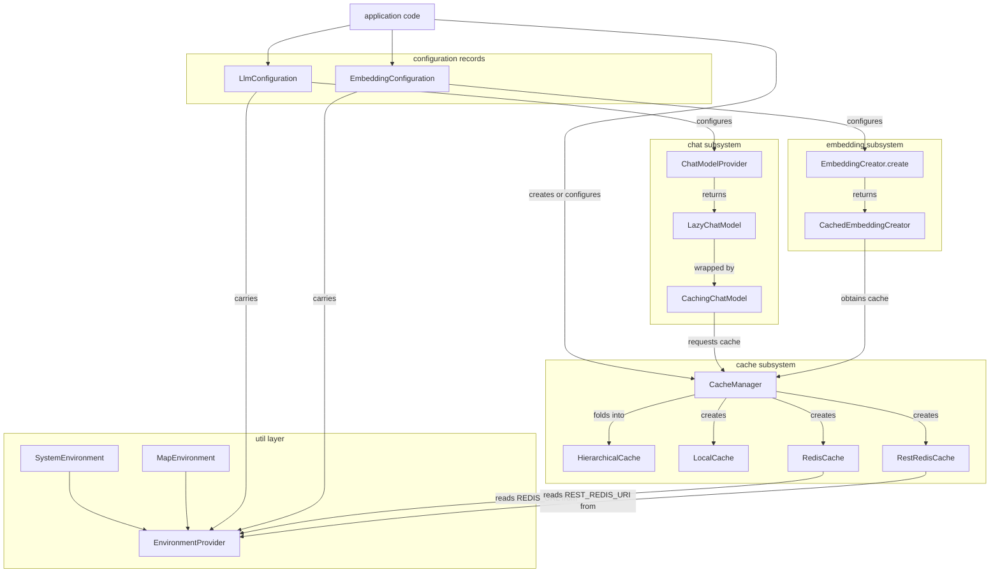

# Architecture Overview

`llm-access` (`io.github.ardoco:llm-access`) is a reusable Java 21 library for talking to LLMs and
embedding models through [LangChain4j](https://docs.langchain4j.dev/), with a pluggable caching
layer around both. The code is organized into four subsystems whose dependency direction is
one-way: the **chat** and **embedding** subsystems build on the **cache** subsystem, and the cache
subsystem reads its configuration from the **util** layer. [Quickstart](../quickstart.md) routes
change areas to the dedicated pages; this page is the map of how the parts fit together.

## Subsystems and dependency direction

| Subsystem | Package(s) | Core types | Depends on |
| --- | --- | --- | --- |
| util | `...llm.util` | `EnvironmentProvider`, `SystemEnvironment`, `MapEnvironment`, `KeyGenerator`, `Futures` | nothing internal (dotenv-java, slf4j) |
| cache | `...llm.cache` (+ `cache.chat`, `cache.embedding`) | `Cache`, `CacheKey`, `CacheParameter`, `CacheType`, `CacheManager`, `HierarchicalCache`, `LocalCache`, `RedisCache`, `RestRedisCache` | util (`EnvironmentProvider`) |
| chat | `...llm.chat` | `ChatModelProvider`, `LlmConfiguration`, `ChatModelPlatform`, `LazyChatModel`, `CachingChatModel`, `ChatModelUtils` | cache (typed chat keys and parameters), util |
| embedding | `...llm.embedding` | `EmbeddingCreator`, `EmbeddingConfiguration`, `EmbeddingPlatform`, `CachedEmbeddingCreator` and platform creators | cache (`CacheManager`), util |

Two rules hold across the whole map:

1. **Dependencies point toward the cache, and from the cache toward util.** `ChatModelProvider`
   exposes its model settings as a `ChatCacheParameter` (`cacheParameters()`), and
   `CachingChatModel`/`ChatModelUtils` are written against `Cache<ChatCacheKey>`; every real
   embedding creator receives a `CacheManager` and stores embeddings in a
   `Cache<EmbeddingCacheKey>` obtained from it. The cache backends in turn read connection settings
   from the `EnvironmentProvider` the manager carries — `REDIS_URL` for direct Redis,
   `REST_REDIS_URI` (plus optional `REST_REDIS_USERNAME`/`REST_REDIS_PASSWORD`) for REST-Redis.
   The util layer depends on nothing internal; it is the base of the stack.
2. **Nothing depends on an application-specific configuration object.** Model settings travel as
   the framework-neutral records `LlmConfiguration` and `EmbeddingConfiguration` (plus, for
   caching, a `CacheManager`). Platform endpoints are either read from the environment
   (`OLLAMA_HOST`, `OPENWEBUI_URL`) or hardcoded per platform
   (`https://api.helmholtz-blablador.fz-juelich.de/v1` for Blablador,
   `https://api.deepseek.com/v1` for DeepSeek) inside `ChatModelProvider`. This neutrality is the
   deliberate replacement for the coupling LiSSA originally required, and it is what lets LiSSA,
   ardoco, and other tools share one implementation.

## Subsystem flow

*Configuration records carry an `EnvironmentProvider`; providers and creators build the LangChain4j
models; `CachingChatModel` and `CachedEmbeddingCreator` obtain their `Cache` instances from a
`CacheManager`, which creates the concrete backends (folding multiple ones into `HierarchicalCache`)
and whose backends read connection settings from the manager's environment.*

## Public API surface

The library's entry points are deliberately small:

- **Chat** — build an `LlmConfiguration` (`of(platform, modelName)` or the builder; defaults
  `DEFAULT_SEED = 133742243`, `DEFAULT_TEMPERATURE = 0.0`), then
  `new ChatModelProvider(config).createChatModel()` for platforms `OPENAI`, `OLLAMA`,
  `BLABLADOR`, `DEEPSEEK`, or `OPENWEBUI`. Wrap the result in
  `new CachingChatModel(model, cache)` for transparent caching, or use `ChatModelUtils` for
  single (`cachedRequest`) and n-fold (`nCachedRequest`) requests. `provider.cacheParameters()`
  yields the `ChatCacheParameter` used to obtain a matching cache from a `CacheManager`
  (see [Chat Models](../chat/chat-models.md) and
  [Cached Chat Requests](../chat/cached-chat.md)).
- **Embeddings** — build an `EmbeddingConfiguration` (`of(platform, modelName)` or
  `onnx(model, pathToModel, pathToTokenizer)`), then
  `EmbeddingCreator.create(configuration[, cacheManager])` for platforms `OLLAMA`, `OPENAI`,
  `ONNX`, `OPENWEBUI`, or `MOCK` (see [Embeddings](../embeddings/embeddings.md)).
- **Cache** — either `CacheManager.setCacheDir(dir[, environment])` followed by
  `CacheManager.getDefaultInstance()`, or a standalone `new CacheManager(path[, environment])`.
  `getCache(origin, parameters)` hands out memoized `Cache` instances; `flush()` persists all of
  them (see [Cache Hierarchy and Manager](../cache/cache-hierarchy.md) and
  [Cache Core](../cache/cache-core.md)).
- **Environment** — an `EnvironmentProvider` implementation passed to the configurations and the
  manager: `SystemEnvironment` (system variables with a lazy `.env` fallback) or `MapEnvironment`
  (immutable in-memory map for tests and programmatic setups)
  (see [Environment and Configuration](../concepts/environment-provider.md)).

## Reproducibility: why seed and temperature live in the cache key

Caching is the intended way to use this library, and it works because cache identity includes
everything that makes a model answer deterministic. A chat cache key carries the model name, the
seed, the temperature, the `CHAT` mode, and the request content; the cache file name is
`<Origin>_<model>_<seed>[_<temperature>].json`. With a fixed seed and temperature, identical
requests therefore map to the same entry and are served from cache instead of being re-sent to the
model — cutting API cost and latency and making runs reproducible. Embedding keys pin seed and
temperature to −1 (embeddings are deterministic) and use the `EMBEDDING` mode, so chat and
embedding entries never collide and different models, seeds, and temperatures stay apart
automatically (see [Cache Keys](../cache/cache-keys.md)).

Two mechanics make this practical:

- `CachingChatModel` funnels every `ChatModel` overload through `doChat`, returns stored responses
  on a hit without contacting the delegate, and flushes immediately after each newly computed
  response so file-backed caches persist incrementally.
- `CachedEmbeddingCreator` caches each embedding under a content-derived key, parallelizes batches
  (per-platform thread counts; OpenAI uses 40), and recovers from over-long inputs by
  jtokkit-driven truncation to `MAX_TOKEN_LENGTH` (8000), cached under a separate `_fixed_` key.

The `LOCAL` backend is what makes the results portable: its files are self-contained, and their
naming (temperature omitted when `0.0`) and embedding key formats are kept backward-compatible with
LiSSA's existing caches. A cache directory therefore doubles as an offline **replication
package** — layer `LOCAL` underneath `REDIS`/`REST_REDIS` while experimenting, flush at the end,
ship the directory, and replicators re-run with `CACHE_HIERARCHY=LOCAL` and no model access
(see [Operations and Deployment](../operations/deployment.md)).

## The no-global-environment invariant

Environments are values, not singletons: an `EnvironmentProvider` is always passed as a
constructor argument or held in an instance field, and the library uses the `CacheManager` it is
given instead of falling back to a global instance. This is enforced, not merely convention, by
two ArchUnit rules in `NoGlobalEnvironmentTest` (which analyzes all non-test classes under
`edu.kit.kastel.mcse.ardoco.llm`):

1. **`noStaticEnvironmentFields`** — no static field may have a type assignable to
   `EnvironmentProvider` ("environments must be injected, not shared globally").
2. **`defaultCacheManagerOnlyInConvenienceOverload`** — `CacheManager.getDefaultInstance()` may
   only be called from `EmbeddingCreator.create(EmbeddingConfiguration)`; everywhere else the
   cache manager — and with it the cache environment — must be injected.

The one sanctioned call site is the convenience overload
`EmbeddingCreator.create(configuration)`, which delegates to
`create(configuration, CacheManager.getDefaultInstance())` and returns a `MockEmbeddingCreator`
before touching the manager when the platform is `MOCK`, so a mock creator can be built without
any cache setup. Creating an environment-less `LlmConfiguration`, `EmbeddingConfiguration`, or
`CacheManager` is not a violation: their builders and constructors default to a **new**
`SystemEnvironment` instance per object (system variables plus `.env`), never to a shared static
one (see [Environment and Configuration](../concepts/environment-provider.md)).

## Toolchain

- **Build**: Java 21 on the `io.github.ardoco:parent` 2.1.0 parent POM; the artifact is
  `io.github.ardoco:llm-access` (`0.2.1-SNAPSHOT`). CI runs `mvn verify` via the shared ardoco
  workflow; `mvn spotless:apply` gates formatting.
- **Model access**: LangChain4j `1.22.0` imported as a BOM — `langchain4j-core`, `langchain4j`,
  `langchain4j-embeddings`, `langchain4j-ollama`, and `langchain4j-open-ai` (used for OpenAI,
  Blablador, DeepSeek, and Open WebUI endpoints).
- **Caching support**: `jtokkit` `1.1.0` (token counting for the long-text fallback),
  `org.fuchss:rest-redis` `0.1.5` (REST-Redis client), Jackson (cache serialization).
- **Environment**: `dotenv-java` `3.2.0` (the `.env` support inside `SystemEnvironment`), slf4j
  for logging.
- **Testing**: Testcontainers (`2.0.5` BOM, test scope) for the Docker-gated REST-Redis
  integration test, plus ArchUnit for the architecture rules above
  (see [Testing Strategy](../testing/strategy.md)).
- **Release plumbing**: `flatten-maven-plugin` is pinned to `1.7.3` because the ardoco parent
  references it without a version and Maven would otherwise resolve `1.8.0`, which has an NPE
  regression in its CI-friendly interpolator. The `central-publishing-maven-plugin` overrides the
  parent's `deploymentName` to `ardoco-llm-access` (with `autoPublish` and `waitUntil published`)
  so the bundle is named distinctly in the Central Publisher Portal.

## Where to read next

- [Chat Models](../chat/chat-models.md) and [Cached Chat Requests](../chat/cached-chat.md) — the chat subsystem in detail.
- [Embeddings](../embeddings/embeddings.md) — the embedding creators, parallelism, and long-text recovery.
- [Cache Core](../cache/cache-core.md), [Cache Keys](../cache/cache-keys.md),
  [Cache Hierarchy and Manager](../cache/cache-hierarchy.md), and
  [Cache Backends](../cache/cache-backends.md) — the caching stack.
- [Environment and Configuration](../concepts/environment-provider.md) — where credentials, hosts, and cache settings come from.
- [Operations and Deployment](../operations/deployment.md) — running the backends and replication packages.
- [Testing Strategy](../testing/strategy.md) — hermetic tests, Docker gating, and the ArchUnit rules.
