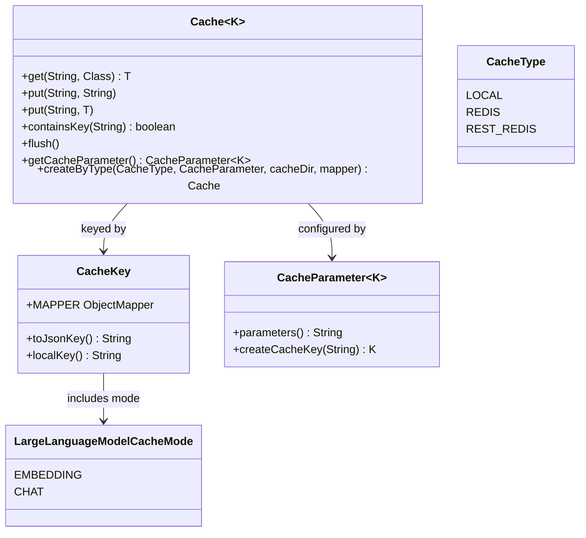

# Cache Core

The cache core defines the abstractions all backends and consumers share. Chat and embedding
caching are built on `Cache<K extends CacheKey>`; concrete backends are described in
[Cache Backends](cache-backends.md), and layering/management in
[Cache Hierarchy and Manager](cache-hierarchy.md).

## Cache

`Cache<K extends CacheKey>` is the storage contract:

- `<T> T get(String key, Class<T> clazz)` — look up by content-derived string key, deserialize.
- `void put(String key, String value)` / `<T> void put(String key, T value)` — store (object
  variants serialize to JSON).
- `boolean containsKey(String key)`, `void flush()`, `CacheParameter<K> getCacheParameter()`.
- `getViaInternalKey` / `putViaInternalKey` (deprecated) expose the internal `K` key form;
  used only by the long-text recovery path in [Embeddings](embeddings.md) and by conflict
  resolution (see [Cache Hierarchy and Manager](cache-hierarchy.md)).
- `static <T> T convert(jsonData, clazz, mapper)` — deserialize helper with a backward-compat
  fallback: if deserialization fails and `clazz == String.class`, returns the raw string.

`Cache.createByType(CacheType type, CacheParameter<K> parameters, @Nullable String cacheDir,
@Nullable ObjectMapper mapper)` is the factory used by `CacheManager.buildCacheHierarchy`:

- `LOCAL` requires a non-null `cacheDir` → `new LocalCache<>(cacheDir, parameters)`.
- `REDIS` and `REST_REDIS` require a non-null `mapper` → `RedisCache` / `RestRedisCache`.

## CacheKey

`CacheKey` is the identifying interface. It holds a shared `MAPPER`
(`ObjectMapper` with `INDENT_OUTPUT`). Two methods:

- `toJsonKey()` — default method; serializes the key to JSON. This is the Redis hash key.
  The `localKey` field is excluded via `@JsonIgnore`.
- `localKey()` — a content-derived UUID (see [KeyGenerator](configuration.md)) used as the
  in-file/in-memory key for `LocalCache`.

Because `mode` (`CHAT` vs `EMBEDDING`) is part of the serialized key, chat and embedding
entries never collide even when model/seed/temperature match. See [Cache Keys](cache-keys.md)
for the concrete implementations.

## CacheParameter

`CacheParameter<K extends CacheKey>` describes what makes a cache unique and how to build keys:

- `String parameters()` — a unique string used as the `LocalCache` file name component
  (`<Origin>_<parameters>.json`). It must uniquely identify the configuration
  (model/seed/temperature for chat, model name for embedding).
- `K createCacheKey(String content)` — combine configuration with content into a key.

## CacheType and LargeLanguageModelCacheMode

- `CacheType` enum: `LOCAL`, `REDIS`, `REST_REDIS`.
- `LargeLanguageModelCacheMode` enum: `EMBEDDING`, `CHAT`. Embedded in each `CacheKey` so
  the two domains are kept apart.

## Focused tests

- `CacheTest` — `testWriteNewEntry`, `testRetrieveExistingEntry`, `testObjectSerialization`
  (round-trip a `TestObject`), and `testBackwardCompatibility` (loads
  `src/test/resources/cache/test-local-cache-sample.json`, a LiSSA-format legacy cache, and
  reads three pre-existing entries by content key). Uses local `TestCacheKey`/`TestCacheParameter`
  helpers and a `@TempDir` cache directory.

*Core cache abstractions: Cache is keyed by CacheKey, configured by CacheParameter, and dispatched by CacheType.*
