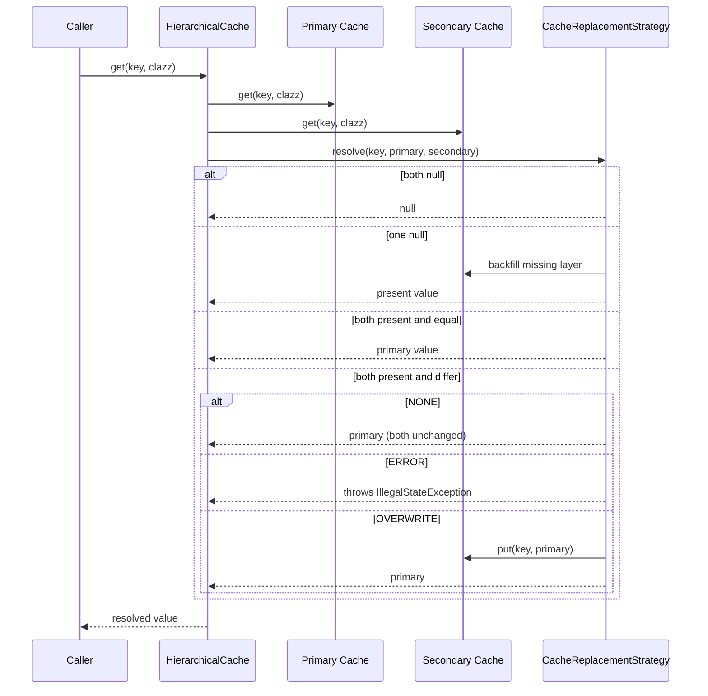

# Cache Hierarchy and Manager

`CacheManager` is the entry point for obtaining caches. It owns the default singleton, parses
the cache hierarchy from the environment, and builds a [HierarchicalCache](#hierarchicalcache)
that stacks [backends](cache-backends.md) primary-first. `CacheReplacementStrategy` decides
what happens when two layers hold different values for the same key.

## CacheManager lifecycle

- `CacheManager.setCacheDir(String)` — must be called once before `getDefaultInstance()`. It
  constructs a new `CacheManager` over the directory (creating it if needed) and stores it as
  the static default. Passing `null` uses `DEFAULT_CACHE_DIRECTORY = "cache"`.
- `CacheManager.getDefaultInstance()` — throws `IllegalStateException` ("Cache directory not
  set") until `setCacheDir` has been called.
- `CacheManager.resetDefaultInstance()` — package-private, flushes and clears the default; used
  by tests for clean state between runs.

The constructor reads configuration from [Environment](configuration.md) at construction time:

- `CACHE_HIERARCHY` (default `LOCAL`) — comma-separated `CacheType` values, primary first.
  Parsing strips quotes/spaces and is case-insensitive; empty entries and unknown values throw.
- `CACHE_REPLACEMENT_STRATEGY` (default `NONE`) — one of `NONE`, `ERROR`, `OVERWRITE`;
  invalid values throw with the list of valid options.

The explicit constructor `CacheManager(Path, CacheReplacementStrategy, List<CacheType>)`
validates that the path is a directory and the hierarchy is non-empty.

## getCache and naming

`getCache(Object origin, CacheParameter<K> parameters)`:

- Name = `origin.getClass().getSimpleName() + "_" + parameters.parameters()`; colons in the
  name are replaced with `__` for safe file names (e.g. `CacheManagerTest_a__b_1.json`).
- Memoized by name: a second call with the same name returns the same instance. If the same
  name is requested with parameters that are not `.equals` to the existing ones, it throws
  `IllegalArgumentException` ("Cache with name ... already exists with different parameters").
- Rejects null `origin` or `parameters`.

`buildCacheHierarchy` creates one cache per `CacheType` via `Cache.createByType` (see
[Cache Core](cache-core.md)), then folds them left into `HierarchicalCache` instances with the
configured `CacheReplacementStrategy`. A single-type hierarchy returns the backend directly
with no layering. The `ObjectMapper` is created once per hierarchy build and shared by the
Redis/REST-Redis backends.

`flush()` flushes every managed cache; used before shipping a replication package (see
[Operations and Deployment](operations.md)).

## HierarchicalCache

`HierarchicalCache<K>` composes a `primaryCache` and a `secondaryCache` (package-private).
For two layers; deeper hierarchies are built by folding (the secondary of one layer becomes
the composite of the next).

- **Write-through:** `put` (both overloads) writes to primary and secondary in order.
- **Read:** `get` reads both layers and delegates to `CacheReplacementStrategy.resolve`,
  which backfills the missing layer whenever one side has a value and the other does not.
- `containsKey` is true if either layer has the key; `flush` flushes both.
- All mutating/reading methods are `synchronized`.

## CacheReplacementStrategy

Conflict = both layers hold a non-null value for the same key and they are not
`Objects.deepEquals`. Backfill (one side null, the other present) always happens and copies
the present value into the missing layer.

| Strategy | Conflict (both non-null, differ) | Backfill |
| --- | --- | --- |
| `NONE` (default) | Return primary; leave both unchanged | Copy present value to missing layer, return it |
| `ERROR` | Throw `IllegalStateException` | Same backfill as NONE |
| `OVERWRITE` | Overwrite secondary with primary, return primary | Same backfill as NONE |

`resolve` and the deprecated `resolveViaInternalKey` mirror each other for the string-key and
internal-key code paths. `deepEquals` is used so array-valued embeddings compare by content.

## Changing layering or strategy

- Backend selection and order live in `CacheManager.parseCacheHierarchy` and the
  `CACHE_HIERARCHY` env var (see [Configuration and Environment](configuration.md)). Add a new
  `CacheType` value in both `CacheType` and the `Cache.createByType` switch.
- Conflict semantics live in `CacheReplacementStrategy` subclasses; add a new enum constant
  overriding `resolve`/`resolveViaInternalKey`. Keep backfill behavior identical unless you
  intend to change it.

## Focused tests

- `CacheManagerTest` — `defaultInstanceRequiresDirectory`, `getCacheRejectsNull`,
  `getCacheIsMemoized`, `getCacheConflictsOnDifferentParameters` (identity-unequal params
  with the same identifier), `sanitizesColonsInFileName`, `flushPersists`,
  `constructorValidation` (empty hierarchy and non-directory path).
- `HierarchicalCacheTest` — mock-based: `put` writes to both, `containsKey` across both,
  `flush` flushes both. Conflict-resolution behavior is tested separately in
  `CacheReplacementStrategyTest`.
- `CacheReplacementStrategyTest` — uses real `LocalCache` instances for primary/secondary:
  NONE identical/conflicting/null-primary, deep-equal objects; ERROR throws on conflict but
  tolerates null-vs-non-null and identical objects; OVERWRITE overwrites on conflict, no-ops
  on identical, backfills in both directions. Also covers the `resolveViaInternalKey` path.

*HierarchicalCache read resolves conflicts via CacheReplacementStrategy and backfills missing layers.*
