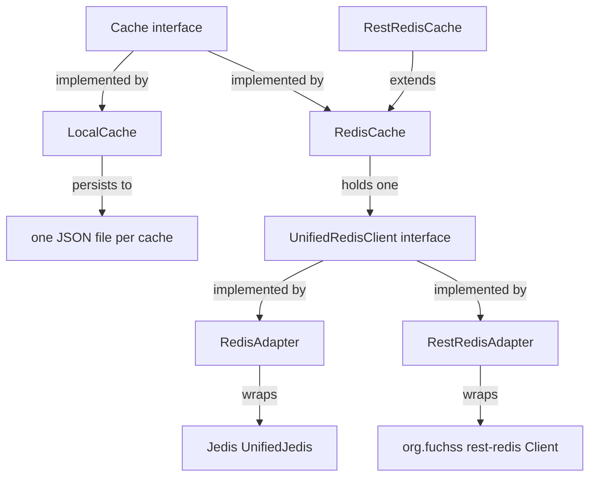

# Cache Backends

Three backends implement `Cache<K>` (see [Cache Core](cache-core.md)). `CacheManager`
(see [Cache Hierarchy and Manager](cache-hierarchy.md)) stacks them into a hierarchy; this page
covers their storage layout and operational contracts.

## Backend composition

*Backend composition: both Redis transports plug into `RedisCache` through the `UnifiedRedisClient` seam; `LocalCache` stands alone.*

Two facts drive the design: local caching is a self-contained JSON file per cache, and Redis
caching has exactly one storage implementation (`RedisCache`) that is generic over the transport.

## LocalCache

`LocalCache<K>` (package-private) is a file-backed `Map<String, String>` persisted as JSON. All
mutating and reading methods are `synchronized`, so one instance can be shared across threads.

- **File:** `<cacheDir>/<name>.json`. `CacheManager` composes the name as `<Origin>_<parameters>`
  (colons replaced by `__`); `ChatCacheParameter` joins model name and seed and omits temperature
  when it is `0.0`, keeping file names backward compatible with LiSSA's existing caches.
- **Within a file:** content is mapped to values via the key's `localKey()` — a deterministic UUID
  derived from the cached content (see [Cache Keys](../cache-keys.md)) — so identical content always
  maps to the same entry.
- **Loading:** at construction, an existing non-blank file is read into memory; a blank file is
  deleted to guarantee a clean state; an unloadable file raises `IllegalArgumentException` naming
  the cache file.
- **Writes:** atomic — `write()` serializes the map to `<file>.tmp.json`, copies it over the
  target with `REPLACE_EXISTING`, and deletes the temp file. `write()` returns early when nothing
  is dirty.
- **Auto-flush:** the dirty counter increments only when a `put` stores a new or different value;
  once it exceeds `MAX_DIRTY = 50`, `write()` runs automatically. `flush()` is an explicit
  `write()`.

Because the files are self-contained, the cache directory is the replication artifact — see
[Operations and Deployment](../operations/deployment.md).

## UnifiedRedisClient — the transport seam

`RedisCache` never talks to a concrete Redis client. It holds a `UnifiedRedisClient`, a public
`AutoCloseable` interface exposing exactly the operations the cache uses: `ping`, `exists`,
`hget`, `hset`, `close`. Its protected constructor accepts an already-connected client, which is
how `RestRedisCache` injects the HTTP transport — and how external code could plug in another
transport. Two package-private adapters implement the seam:

- `RedisAdapter` — wraps a Jedis `UnifiedJedis`; `ping` succeeds only when the reply equals
  `PONG`; `close` shuts the connection down.
- `RestRedisAdapter` — delegates `ping`, `exists`, `hget`, `hset`, `close` directly to
  `org.fuchss:rest-redis`'s `Client`.

## RedisCache

`RedisCache<K>` (package-private) stores each entry as a Redis hash:

- **Hash key:** `cacheKey.toJsonKey()` (the JSON form of the key — see [Cache Keys](../cache-keys.md)).
- **Fields:** `data` (the stored value, serialized to JSON) and `timestamp`
  (`Instant.now().getEpochSecond()`). The timestamp is written on every `put` but never read back.
- `get` reads the `data` field and deserializes; `containsKey` uses Redis `EXISTS` on the hash
  key; `flush` is a no-op (Redis persists immediately). `get`/`put` are `synchronized`; the
  deprecated `getViaInternalKey`/`putViaInternalKey` mirror them for the internal-key path.

**Fail-fast:** `RedisCache.createRedisConnection()` reads `REDIS_URL` (unset or blank falls back
to `redis://localhost:6379`), builds a `RedisAdapter` over `redis.clients.jedis.RedisClient`, and
pings. If `PING` fails it closes the client and throws `IllegalStateException` ("Could not connect
to Redis. Make sure the container is up and running."). There is no silent fallback — pair a remote
backend with `LOCAL` (see [Cache Hierarchy and Manager](cache-hierarchy.md)) if you want a local
fallback layer.

## RestRedisCache

`RestRedisCache<K>` (package-private) extends `RedisCache` and overrides only connection setup.
It is for clients that can reach Redis only over HTTP (firewall / HTTP-only egress), using
`org.fuchss:rest-redis`'s `Client`.

- Reads `REST_REDIS_URI` (unset or blank falls back to `http://localhost:8080`),
  `REST_REDIS_USERNAME`, and `REST_REDIS_PASSWORD`. Username and password are optional; blank
  values are treated as unset and are sent as HTTP Basic auth only when set. The server itself has
  no auth/TLS — terminate them at a reverse proxy (see
  [Operations and Deployment](../operations/deployment.md)).
- Wraps the `Client` in a `RestRedisAdapter` and applies the same fail-fast contract: if `PING`
  fails, it closes the client and throws `IllegalStateException` ("Could not connect to Redis at
  <uri>").

All storage behavior (hash key, `data`/`timestamp` fields, no-op `flush`) is inherited from
`RedisCache`.

## Construction and wiring

`Cache.createByType` (see [Cache Core](cache-core.md)) requires a `cacheDir` for `LOCAL` and an
`ObjectMapper` for `REDIS` and `REST_REDIS` (throwing `IllegalArgumentException` otherwise) and
forwards the [Environment](../configuration.md) to the Redis-based backends so they can read their
connection settings. `CacheManager` hands every layer of one hierarchy the same cache-file path and
one shared `ObjectMapper`; the Redis-based layers simply ignore the file path.

## Adding a backend

1. Add a `CacheType` constant and a `case` in `Cache.createByType` (construct the backend from
   `CacheParameter` and, where needed, `cacheDir`/`mapper`).
2. Implement `Cache<K>` (or extend an existing backend like `RestRedisCache` extends
   `RedisCache`).
3. If it needs connection details, read them through [Environment](../configuration.md) and
   preserve the fail-fast PING contract so layering and conflict strategies remain safe.
4. Add tests mirroring `RestRedisTest` (Testcontainers where a real server is needed; the
   `@Testcontainers(disabledWithoutDocker = true)` annotation skips gracefully without Docker).

## Focused tests

- `CacheTest` — local backend persistence: new entries land in the cache file after `flush`, a
  fresh instance reads them back, objects survive a Jackson round-trip, and legacy cache files
  stay readable (see [Cache Core](cache-core.md) and [Testing Strategy](../testing/strategy.md)).
  Run with `mvn -q test -Dtest=CacheTest`.
- `RestRedisTest` — Docker-gated (`@Testcontainers(disabledWithoutDocker = true)`) integration
  test: a Testcontainers `redis:latest` container plus an in-process `rest-redis` `Server` on a
  free port, with connection settings injected through a `MapEnvironment`. It covers the
  connection (also via `Cache.createByType(CacheType.REST_REDIS, ...)`), set/get with `null` for
  missing keys, and `HierarchicalCache` behavior across a local + REST-Redis pair: `NONE` returns
  the primary value and leaves the secondary unchanged, `OVERWRITE` overwrites the secondary after
  `flush`, `ERROR` throws `IllegalStateException` ("Cache inconsistency"), and a Redis-only value
  is backfilled into the local layer. Run with `mvn -q test -Dtest=RestRedisTest`.
