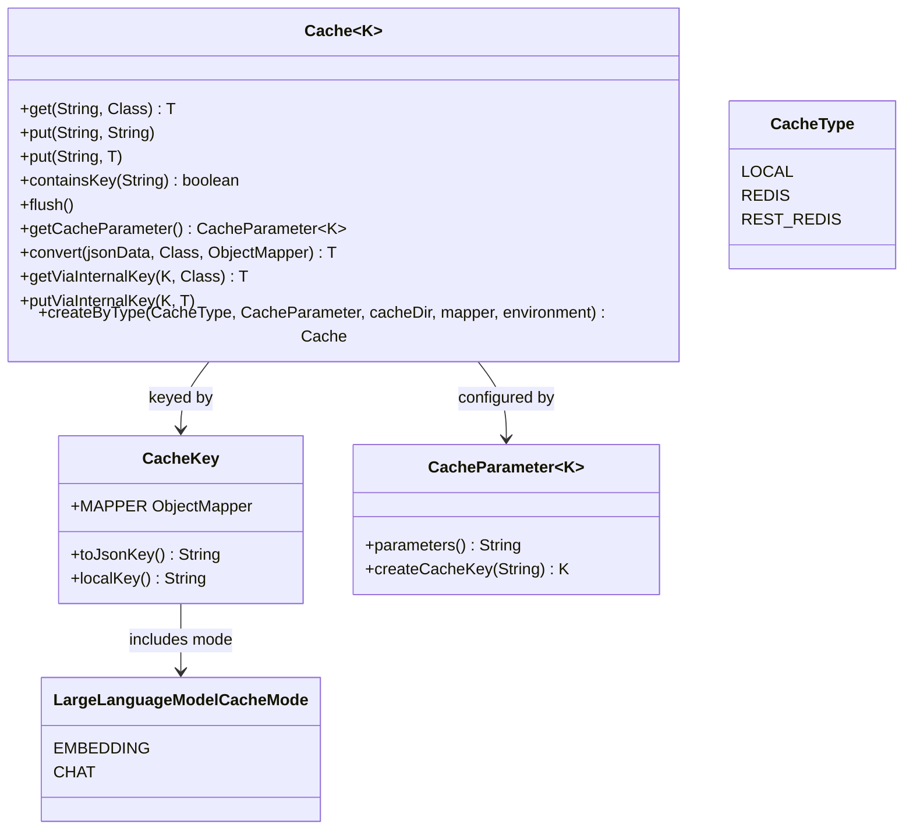

# Cache Core

The cache core defines the abstractions all backends and consumers share. Chat and embedding
caching are built on `Cache<K extends CacheKey>`; concrete backends are described in
[Cache Backends](cache-backends.md), layering and management in
[Cache Hierarchy and Manager](cache-hierarchy.md), and the concrete key types in
[Cache Keys](cache-keys.md).

## Cache

`Cache<K extends CacheKey>` is the storage contract. Values are always persisted as JSON strings,
and the interface keeps that true at every boundary:

- `<T> T get(String key, Class<T> clazz)` — look up by the caller-facing content string and
  deserialize; returns `null` when absent.
- `void put(String key, String value)` and `<T> void put(String key, T value)` — store; the
  object variant is serialized to JSON before storage.
- `boolean containsKey(String key)`, `void flush()`, `CacheParameter<K> getCacheParameter()`.
- `getViaInternalKey(K key, Class<T> clazz)` / `putViaInternalKey(K key, T value)` — **deprecated**
  (`forRemoval = false`, javadoc: "DO NOT USE UNLESS YOU KNOW WHAT YOU ARE DOING"). They take the
  internal `K` key directly instead of deriving it from content. Their only legitimate call sites
  are the long-text embedding recovery path (`CachedEmbeddingCreator.tryToFixWithLength`, which
  must address a truncated-prefix entry under a custom local key via the deprecated
  `EmbeddingCacheKey.ofRaw`) and layer conflict resolution (`HierarchicalCache` and
  `CacheReplacementStrategy.resolveViaInternalKey`, which must copy and overwrite values between
  two layered caches without access to the original content). Everything else must go through the
  content-string methods so the mode-separation and key-derivation invariants hold.
- `static <T> T convert(jsonData, clazz, mapper)` — the deserialize helper every backend routes
  reads through. `null` input returns `null`. If deserialization fails and the target type is
  `String`, the raw string is returned — this keeps legacy, unserialized cache entries (plain
  string values written before JSON-string storage) readable. Any other deserialization failure
  throws `IllegalArgumentException`.

Callers never handle `CacheKey` instances directly: the backends derive the physical key from the
content string via the `CacheParameter` on every `get`/`put`/`containsKey`. Only the deprecated
internal-key methods bypass that derivation.

`Cache.createByType(CacheType type, CacheParameter<K> parameters, @Nullable String cacheDir,
@Nullable ObjectMapper mapper, EnvironmentProvider environment)` is the factory that
`CacheManager.buildCacheHierarchy` uses to instantiate every layer (each hierarchy shares one
`ObjectMapper` and one cache-file path; the Redis-based layers ignore the file path):

- `LOCAL` requires a non-null `cacheDir` → `new LocalCache<>(cacheDir, parameters)`; a missing
  directory throws `IllegalArgumentException`.
- `REDIS` and `REST_REDIS` require a non-null `mapper` → `RedisCache` / `RestRedisCache`, which
  receive the [Environment](../concepts/environment-provider.md) and read their connection
  settings from it (`REDIS_URL` for `RedisCache`; URI and credentials for `RestRedisCache`).
  A missing mapper throws `IllegalArgumentException`.

## CacheKey

`CacheKey` identifies a cache entry. It exposes a shared static `MAPPER` (`ObjectMapper`
configured with `SerializationFeature.INDENT_OUTPUT`) and two addressing methods that are
deliberately kept apart:

- `toJsonKey()` — default method that serializes the whole key with `MAPPER`; a serialization
  failure throws `IllegalArgumentException`. This JSON string is the **Redis hash key**:
  `RedisCache` addresses entries by it. The concrete keys annotate `localKey` (field and getter)
  with `@JsonIgnore`, so the JSON key never contains it.
- `localKey()` — "the key used to address this entry in file-based caches and in log output". It
  is a deterministic UUID derived from the cached content only (`KeyGenerator.generateKey`:
  `nameUUIDFromBytes` over the CRLF-normalized UTF-8 content; `ChatCacheKey.of` and
  `EmbeddingCacheKey.of` both set it this way), so `LocalCache` maps identical content to the
  same entry within its file.

The split is deliberate. Redis-backed caches need an address that carries the full configuration
(mode, model, seed, temperature, content) so entries of different configurations cannot overwrite
each other in a shared store — that is `toJsonKey()`. File-based caches isolate configurations per
file (`parameters()`) and only need a stable, content-derived handle inside the file — that is
`localKey()`, which is also what log lines reference. The two keys address the same logical entry
from the two storage worlds; a `LocalCache` read goes through `localKey()`, a `RedisCache` read
through `toJsonKey()`.

Because `mode` (`CHAT` vs `EMBEDDING`) is a serialized field of every concrete key, the JSON keys
of a chat entry and an embedding entry never collide even for identical model and content; local
files are additionally separated per cache. See [Cache Keys](cache-keys.md) for the concrete
implementations.

## CacheParameter

`CacheParameter<K extends CacheKey>` describes what makes a cache unique and how keys are built:

- `String parameters()` — a unique string identifying the configuration (model/seed/temperature
  for chat, model name for embedding); it is the file-name component `CacheManager` uses for
  `LocalCache` files (`<Origin>_<parameters>.json`).
- `K createCacheKey(String content)` — combines the configuration with the content into a key.
  This is the single point where caller-facing content strings become cache keys.

`ChatCacheParameter` and `EmbeddingCacheParameter` are the two concrete records — see
[Cache Keys](cache-keys.md).

## CacheType and LargeLanguageModelCacheMode

- `CacheType` enum: `LOCAL` (file-based local cache), `REDIS` (Redis-based local docker
  container), `REST_REDIS` (remote Redis instance accessible via a REST API). It selects the
  backend in `Cache.createByType`.
- `LargeLanguageModelCacheMode` enum: `EMBEDDING`, `CHAT`. It is embedded as a serialized field in
  each `CacheKey`, keeping the two caching domains apart (see the invariant above and
  [Cache Keys](cache-keys.md)).

## Focused tests

- `CacheTest` — local persistence and backward compatibility. Each test resets the
  `CacheManager` default instance with a `MapEnvironment` (`CACHE_HIERARCHY=LOCAL`,
  `CACHE_REPLACEMENT_STRATEGY=ERROR`) and builds a `LocalCache` directly over a `@TempDir` file
  using local `TestCacheKey`/`TestCacheParameter` helpers. Cases: `testWriteNewEntry` (entries
  land in the cache file after `flush`), `testRetrieveExistingEntry` (a fresh instance reads them
  back), `testObjectSerialization` (objects survive a Jackson round-trip), and
  `testBackwardCompatibility` (copies the legacy fixture
  `src/test/resources/cache/test-local-cache-sample.json` — content-UUID keys mapped to plain,
  unserialized string values — and reads all three entries, which is exactly the path where
  `convert`'s String fallback applies).
- Run with `mvn -q test -Dtest=CacheTest`.

*Core cache abstractions: Cache is keyed by CacheKey, configured by CacheParameter, and dispatched by CacheType; `convert` centralizes JSON reading and the deprecated internal-key methods are the only content-bypassing path.*
