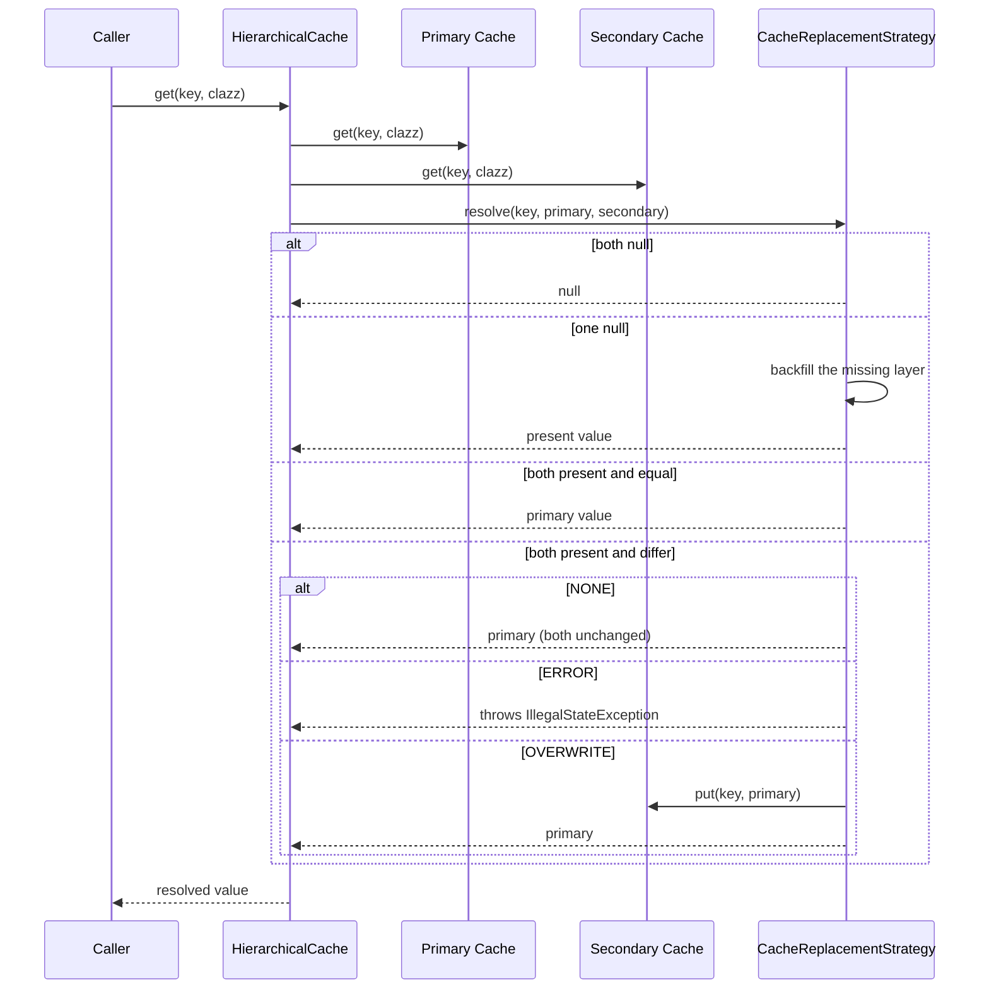

# Cache Hierarchy and Manager

`CacheManager` is the entry point for obtaining caches. It owns the default singleton, derives
cache names from the requesting origin and its parameters, and builds a
[HierarchicalCache](#hierarchicalcache) that stacks the [backends](cache-backends.md)
primary-first over the [storage abstractions](cache-core.md). `CacheReplacementStrategy` decides
what happens when two layers hold different values for the same key. Chat and embedding model
code obtain their caches here (see [Cache Keys](cache-keys.md) for the concrete key types and
[Architecture Overview](../architecture/overview.md) for where the cache subsystem sits).

## CacheManager lifecycle

- `CacheManager.setCacheDir(String)` — replaces the static default instance with a manager over
  the given directory (creating it if needed). Passing `null` uses
  `DEFAULT_CACHE_DIRECTORY = "cache"`. The single-argument variant reads the cache configuration
  and the Redis connection settings from a **new `SystemEnvironment()`**; the two-argument
  variant `setCacheDir(String, EnvironmentProvider)` takes an injected
  [environment](../concepts/environment-provider.md). Both are `static synchronized` and throw
  `IOException` when the directory cannot be created. Calling `setCacheDir` again installs a
  fresh manager whose cache memoization starts empty.
- `CacheManager.getDefaultInstance()` — returns the default instance, throwing
  `IllegalStateException` ("Cache directory not set") until `setCacheDir` has been called.
- `CacheManager.resetDefaultInstance()` — package-private, `static synchronized`: flushes the
  default instance if one exists, then clears it. Intended for testing only; after calling it,
  `setCacheDir` must be called again before `getDefaultInstance`.

The instance constructors come in three shapes:

- `CacheManager(Path cacheDir)` — reads configuration from a new `SystemEnvironment()`.
- `CacheManager(Path cacheDir, EnvironmentProvider environment)` — reads the replacement
  strategy and the hierarchy from the environment **at construction time**.
- `CacheManager(Path cacheDir, CacheReplacementStrategy replacementStrategy, List<CacheType> hierarchyConfig, EnvironmentProvider environment)`
  — explicit values, still requiring an environment because the Redis-based backends read their
  connection settings from it later.

All three funnel into the explicit constructor, which validates its inputs: it creates the
directory when it does not exist, throws `IllegalArgumentException` ("path is not a directory: …")
when the path exists but is not a directory, throws `IllegalArgumentException` when the hierarchy
list is empty, and `Objects.requireNonNull`s the strategy, hierarchy, and environment.

### Configuration timing

The hierarchy and the replacement strategy are read once at construction and kept in fields;
they never change for the lifetime of the manager. The Redis connection settings are read later:
`buildCacheHierarchy` instantiates the backends only when a cache is first requested via
`getCache`, and the Redis-backed constructors connect (and fail fast) at that point. A manager
built with a `REDIS` hierarchy therefore does not touch the network until the first `getCache`
call — `CacheManagerTest.passesEnvironmentToRedisCache` pins this down by asserting that the
`JedisConnectionException` names the `REDIS_URL` injected at construction.

## Configuration values

- `CACHE_HIERARCHY` (default `LOCAL`) — comma-separated `CacheType` values, **primary first**.
  Parsing removes single quotes, replaces double quotes with spaces, splits on commas, trims each
  entry, and maps it case-insensitively to the `CacheType` enum. Empty entries throw
  `IllegalArgumentException` ("Cache hierarchy contains empty cache type"); unknown values throw
  with the list of valid options.
- `CACHE_REPLACEMENT_STRATEGY` (default `NONE`) — one of `NONE`, `ERROR`, `OVERWRITE`, parsed via
  `valueOf` after trimming and upper-casing; invalid values throw `IllegalArgumentException`
  listing the valid options.

Both are read from the manager's `EnvironmentProvider`, so tests can inject a `MapEnvironment`
and applications a `.env`-backed `SystemEnvironment`.

## getCache: naming and memoization

`getCache(Object origin, CacheParameter<K> parameters)` is designed for use by model
implementations:

- The name is `origin.getClass().getSimpleName() + "_" + parameters.parameters()`; passing a
  `null` origin or `null` parameters throws `IllegalArgumentException`.
- Every colon in the name is replaced with a double underscore (`:` → `__`) before use, so model
  names such as `a:b` produce safe file names (`CacheManagerTest_a__b_1.json`).
- The resulting `Cache` is **memoized by name** within the manager: a repeated request with
  parameters equal to the stored ones returns the same instance, while the same name requested
  with parameters that are **not** `equals` to the stored ones throws `IllegalArgumentException`
  ("Cache with name … already exists with different parameters"). The conflict is detected on the
  `CacheParameter` objects, not on the derived name — two identity-distinct parameter objects
  that yield the same `parameters()` identifier collide (see
  `CacheManagerTest.getCacheConflictsOnDifferentParameters`).

`flush()` flushes every cache this manager has handed out (see
[HierarchicalCache](#hierarchicalcache) for the cascade into the layers).

## buildCacheHierarchy: stacking the layers

`buildCacheHierarchy(name, parameters)` creates one backend per configured `CacheType` via
`Cache.createByType` (see [Cache Core](cache-core.md)) and folds them left into
`HierarchicalCache` instances:

1. One `ObjectMapper` is created per hierarchy build and handed to every layer, together with the
   cache-file path `<cacheDir>/<name>.json` (the Redis-based layers ignore the file path).
2. `Cache.createByType` instantiates `LocalCache`, `RedisCache`, or `RestRedisCache` per type.
3. The created caches are folded left: the first cache starts as the composite, and each next
   cache is layered over it via `new HierarchicalCache<>(parameters, compositeSoFar, next, strategy)`.
   The first type in `CACHE_HIERARCHY` is therefore the primary layer of the outermost composite.
4. A single-type hierarchy returns the backend directly, with no layering.

Deeper hierarchies nest: for types `[A, B, C]` the result is `((A,B),C)` — the composite of the
earlier layers becomes the primary of the next `HierarchicalCache`, so a read resolves the
innermost pair first and the outermost pair last.

## HierarchicalCache

`HierarchicalCache<K>` (package-private) implements `Cache<K>` by composing a `primaryCache` and
a `secondaryCache` plus the configured `CacheReplacementStrategy`; all four constructor arguments
are `Objects.requireNonNull`ed.

- **Write-through:** every `put` variant (`put(String, String)`, `put(String, T)`,
  `putViaInternalKey`) writes to the primary and then to the secondary layer.
- **Read:** `get` reads both layers and delegates to `CacheReplacementStrategy.resolve`, which
  backfills whichever layer is missing the value; `getViaInternalKey` mirrors this via
  `resolveViaInternalKey`.
- **Membership:** `containsKey` is true when either layer holds the key.
- **Flush:** `flush` flushes both layers, so `CacheManager.flush()` cascades to every layer of
  every memoized cache — the step performed before shipping a `LOCAL` cache directory as a
  replication package (see [Operations and Deployment](../operations/deployment.md)).
- **Synchronization:** the read/write paths (`get`, `getViaInternalKey`, all `put` variants) are
  `synchronized` on the instance, so one composite can be shared across threads. `containsKey` and
  `flush` are not synchronized; they only delegate to the layers, which synchronize their own
  state.


*Layered read: both layers are queried, the strategy resolves the pair, and a value present in only one layer is backfilled into the other (in either direction).*

## CacheReplacementStrategy

A **conflict** exists only when both layers hold a non-null value for the same key and the values
are not `Objects.deepEquals`-equal — `deepEquals` is used so structurally equal values (such as
deserialized embeddings or other arrays) count as agreement, not conflict.

| Strategy | Conflict (both non-null, differ) | Backfill (exactly one side null) | Both null / equal |
| --- | --- | --- | --- |
| `NONE` (default) | Return the primary value; leave both layers unchanged | Copy the present value into the missing layer, return it | Return the primary value |
| `ERROR` | Log an error and throw `IllegalStateException` ("Cache inconsistency detected for key …") | Same backfill as `NONE` | Same as `NONE` |
| `OVERWRITE` | Log a warning, overwrite the secondary with the primary value, return the primary value | Same backfill as `NONE` | Same as `NONE` |

Precisely:

- The **base `resolve`** handles backfill and the no-conflict cases: when the primary is `null`
  and the secondary is not, the secondary value is written into the primary and returned; when
  the primary is present and the secondary is `null`, the primary value is written into the
  secondary and returned; otherwise (both present and equal, or both `null`) the primary value is
  returned. Backfill happens for **every** strategy — `ERROR` and `OVERWRITE` only override the
  conflict case and delegate the rest to the base implementation.
- **`ERROR`** throws `IllegalStateException` on a `deepEquals`-mismatched pair of non-null
  values (after logging the key and both values). It tolerates null-vs-non-null pairs and
  identical content.
- **`OVERWRITE`** resolves a conflict by writing the primary value into the secondary cache and
  returning the primary value, after logging a warning with the overwritten value.

`resolve` and the deprecated `resolveViaInternalKey` mirror each other for the string-key and
internal-key code paths: the base internal-key variant backfills via `putViaInternalKey`, and the
`ERROR`/`OVERWRITE` constants override both methods with the same conflict semantics. The
internal-key variants exist because layer resolution must copy and overwrite values between two
layered caches without access to the original content (see [Cache Core](cache-core.md)).

## Consumers

- **Embeddings:** `CachedEmbeddingCreator` obtains its cache in its constructor via
  `cacheManager.getCache(this, embeddingCacheParameter)`. `EmbeddingCreator.create(configuration)`
  wires `CacheManager.getDefaultInstance()`; `create(configuration, cacheManager)` passes an
  explicit manager (the mock platform needs no cache).
- **Chat:** the cache is injected rather than fetched. `CachingChatModel` and
  `ChatModelUtils.cachedRequest`/`nCachedRequest` take the `Cache<ChatCacheKey>` as an argument;
  the caller combines `ChatModelProvider.cacheParameters()` — a `ChatCacheParameter` over model
  name, seed, and temperature — with the manager, e.g.
  `CacheManager.getDefaultInstance().getCache(this, parameters)` as the tests do.

## Changing layering or strategy

- Backend selection and order live in the `CACHE_HIERARCHY` environment variable and its
  `CacheManager.parseCacheHierarchy` parsing; add a new `CacheType` constant and a matching case
  in `Cache.createByType` (see [Cache Backends](cache-backends.md)).
- Conflict semantics live in the `CacheReplacementStrategy` enum bodies: add a new constant that
  overrides `resolve`/`resolveViaInternalKey` for the conflict case and delegates the rest to the
  base implementation. Keep the backfill behavior identical unless you intend to change it —
  both `ERROR` and `OVERWRITE` rely on delegating backfill to the base `resolve`.

## Focused tests

- `CacheManagerTest` — singleton lifecycle (`defaultInstanceRequiresDirectory`), `getCache`
  null rejection, memoization, the parameter-conflict `IllegalArgumentException`
  (`getCacheConflictsOnDifferentParameters`, using identity-unequal parameters with the same
  identifier), colon sanitization in file names, flush persistence, constructor validation
  (empty hierarchy, non-directory path), environment-driven configuration
  (`readsConfigurationFromInjectedEnvironment`), and that the injected environment reaches the
  Redis cache (`passesEnvironmentToRedisCache`).
- `HierarchicalCacheTest` — mock-based layer synchronization: `put` writes to both layers,
  `containsKey` is true when either layer has the key and false when neither does, and `flush`
  flushes both. Conflict resolution is deliberately tested separately.
- `CacheReplacementStrategyTest` — real `LocalCache` instances for primary and secondary: `NONE`
  identical/conflicting/null-primary and deep-equal-object cases; `ERROR` throws on conflict but
  tolerates null-vs-non-null and identical objects; `OVERWRITE` overwrites on conflict, does not
  overwrite identical values, and backfills in both directions. Also covers the
  `resolveViaInternalKey` path.

Run them with:

```sh
mvn -q test -Dtest=CacheManagerTest,HierarchicalCacheTest,CacheReplacementStrategyTest
```
