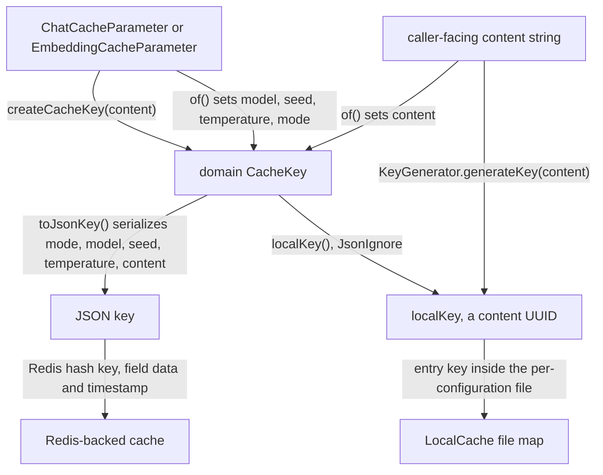

# Cache Keys

The typed key layer turns a caller-facing content string plus a cache configuration into the
addresses the cache backends use. Two record/`CacheKey` pairs implement the [Cache
Core](cache-core.md) abstractions — `ChatCacheParameter`/`ChatCacheKey` for chat caching and
`EmbeddingCacheParameter`/`EmbeddingCacheKey` for embedding caching — and the `KeyGenerator`
utility derives the content UUID every key carries as `localKey`. Production code obtains its
caches through these parameters via `CacheManager` (see [Cache Hierarchy and
Manager](cache-hierarchy.md)).

Both key types are `@JsonAutoDetect(fieldVisibility = ANY)` with `@JsonInclude(NON_NULL)`, so all
fields serialize, and both annotate `localKey` (field and getter) with `@JsonIgnore` so it never
appears in the JSON key. `equals`/`hashCode` cover all fields including `localKey`, but the class
check means a `ChatCacheKey` is never equal to an `EmbeddingCacheKey`.

## KeyGenerator

`edu.kit.kastel.mcse.ardoco.llm.util.KeyGenerator` is a final utility class (private constructor
throwing `IllegalAccessError`) with one static method:

- `KeyGenerator.generateKey(String input)` normalizes `\r\n` to `\n` and returns a deterministic
  type-3 (name-based) UUID via `UUID.nameUUIDFromBytes` over the UTF-8 bytes of the normalized
  input. A `null` input throws `IllegalArgumentException`.

It serves two purposes:

1. **`localKey` of every cache key** — `ChatCacheKey.of` and `EmbeddingCacheKey.of` both set it via
   `KeyGenerator.generateKey(content)`, which is what lets `LocalCache` map identical content to the
   same entry within a cache file.
2. **Content-hash logging** — `CachedEmbeddingCreator` logs `KeyGenerator.generateKey(content)` when
   it starts ("Calculating embedding for: …") and when embedding generation fails ("Error while
   calculating embedding for .. try to fix ..: …"), so log lines reference exactly the identifier a
   file-based cache stores the value under.

The generated keys are part of the on-disk cache format, so they must stay stable across releases:
`KeyGeneratorTest.stableUuidValue` pins `generateKey("test")` to the value
`098f6bcd-4621-3373-8ade-4e832627b4f6` (an MD5 name UUID) precisely for backward compatibility.

## ChatCacheParameter and ChatCacheKey

`ChatCacheParameter(String modelName, int seed, double temperature)` is a record implementing
`CacheParameter<ChatCacheKey>`:

- `parameters()` builds the file-name component by joining model name and seed with `_` and appending
  the temperature — **but only when the temperature is not `0.0`**: `gpt-4o_42` for temperature
  `0.0`, `gpt-4o_42_0.5` otherwise. This is the LiSSA file-name compatibility rule; the cache file
  is `<Origin>_<parameters>.json` (e.g. `CacheManagerTest_model_7.json` in `CacheManagerTest`),
  so unconditionally appending `0.0` would rename every existing temperature-0.0 cache file and
  orphan its entries.
- `createCacheKey(content)` → `ChatCacheKey.of(this, content)`; this is the single point where a
  caller-facing content string becomes a cache key.

`ChatCacheKey` is a final class with fields `model`, `seed`, `temperature`, `mode`, `content`, and
`localKey` (a content UUID from `KeyGenerator`, excluded from JSON). The constructor is private;
`ChatCacheKey.of` is the package-private preferred factory and pins `mode` to
`LargeLanguageModelCacheMode.CHAT` while deriving `localKey` from the content. Its `equals` and
`hashCode` include `localKey` alongside `model`, `seed`, `temperature`, `mode`, and `content`.

## EmbeddingCacheParameter and EmbeddingCacheKey

`EmbeddingCacheParameter(String modelName)` is a record implementing
`CacheParameter<EmbeddingCacheKey>`. Embeddings are deterministic, so the model name alone
identifies the cache:

- `parameters()` returns the bare model name (e.g. `text-embedding-ada-002`).
- `createCacheKey(content)` → `EmbeddingCacheKey.of(this, content)`.

`EmbeddingCacheKey` is a final class with fields `model`, `seed` (always `-1`), `temperature`
(always `-1`), `mode` (always `EMBEDDING`), `content`, and `localKey` (content UUID from
`KeyGenerator`). The `-1`/`-1` values carry no information — embeddings have no seed or temperature —
and exist purely as backward-compatibility markers so the serialized keys resemble the historical
format of existing embedding caches.

### The deprecated ofRaw path

`EmbeddingCacheKey.ofRaw(String model, String content, String localKey)` is `@Deprecated`
(`forRemoval = false`); its javadoc warns that you should always prefer `of` because it only exists
for keys with a **custom local key**. Its single production call site is the long-text recovery path
in `CachedEmbeddingCreator.tryToFixWithLength`: when embedding generation fails (typically because
the input exceeds `MAX_TOKEN_LENGTH = 8000` tokens), the fix path must address a previously stored
truncated-prefix entry under the custom local key `<original localKey>_fixed_8000` with content
`"(FIXED::8000): …"`, which `of` (content-derived local key) cannot express. The lookup itself goes
through the equally deprecated `Cache.getViaInternalKey`. `EmbeddingCacheKeyTest.ofRawCustomLocalKey`
guards that `ofRaw` preserves the custom local key. See [Embeddings](../embeddings/embeddings.md)
for the surrounding recovery flow.

## How one entry gets two addresses

*How a content string and a cache parameter become the two addresses of one entry: the content UUID `localKey` for file caches and logs, and the configuration-complete JSON key for Redis addressing.*

## Why entries never collide

Two independent mechanisms keep entries of different domains and configurations apart:

- **Mode is embedded in the serialized key.** `LargeLanguageModelCacheMode` (`CHAT` vs `EMBEDDING`)
  is a field of every concrete key, so `toJsonKey()` — the hash key `RedisCache` addresses entries
  by — differs between a chat entry and an embedding entry even for identical model and content.
  Differing model, seed, or temperature change the JSON equally. A shared Redis store therefore
  cannot have one configuration's entry overwrite another's.
- **Parameters are embedded in the cache file name.** `CacheManager` names the `LocalCache` file
  `<Origin>_<parameters>.json`, and `parameters()` differs per configuration (chat:
  `<model>_<seed>[_<temperature>]`; embedding: the bare model name). Distinct configurations never
  share a file, and within a file entries are keyed by the content-only `localKey`, so collisions
  are impossible there as well.

## What must stay stable for LiSSA compatibility

The library was extracted from [LiSSA](https://github.com/ardoco/lissa) (see [Architecture
Overview](../architecture/overview.md)), and existing LiSSA cache directories must remain readable.
That pins a small compat-critical surface; changing any of it breaks resolution of existing `LOCAL`
cache entries:

- `KeyGenerator.generateKey`: CRLF→LF normalization, UTF-8 bytes, and the MD5 name-based UUID form
  (guarded by `KeyGeneratorTest.stableUuidValue` and `normalizesLineEndings`).
- `ChatCacheParameter.parameters()`: omitting the temperature component at `0.0`
  (`ChatCacheKeyTest.parametersOmitZeroTemperature`).
- `EmbeddingCacheKey`: the `-1` seed/temperature markers, the `EMBEDDING` mode, and the
  `<localKey>_fixed_8000` custom local key of the recovery path
  (`EmbeddingCacheKeyTest.ofRawCustomLocalKey`).

Redis-backed caches are equally sensitive: `toJsonKey()` is their address, so any change to the
serialized fields of either key class invalidates stored Redis entries.

## Focused tests

- `ChatCacheKeyTest` — `parametersOmitZeroTemperature` (`gpt-4o_42`),
  `parametersIncludeTemperature` (`gpt-4o_42_0.5`), `createCacheKey` (model, content, and
  `localKey == KeyGenerator.generateKey("hello")`), `jsonKeyExcludesLocalKey` (asserts the model,
  `CHAT`, and content are present and the local key is absent from `toJsonKey()`), and `equality`.
- `EmbeddingCacheKeyTest` — `parametersAreModelName`, `createCacheKey`, `jsonKeyExcludesLocalKey`
  (asserts `EMBEDDING` present, local key absent), `ofRawCustomLocalKey`, and `equality`.
- `KeyGeneratorTest` — `deterministic`, `normalizesLineEndings`, `distinctInputs`,
  `stableUuidValue` (the pinned `098f6bcd-4621-3373-8ade-4e832627b4f6`), and `nullInput`.

Run with `mvn -q test -Dtest=ChatCacheKeyTest,EmbeddingCacheKeyTest,KeyGeneratorTest`.
