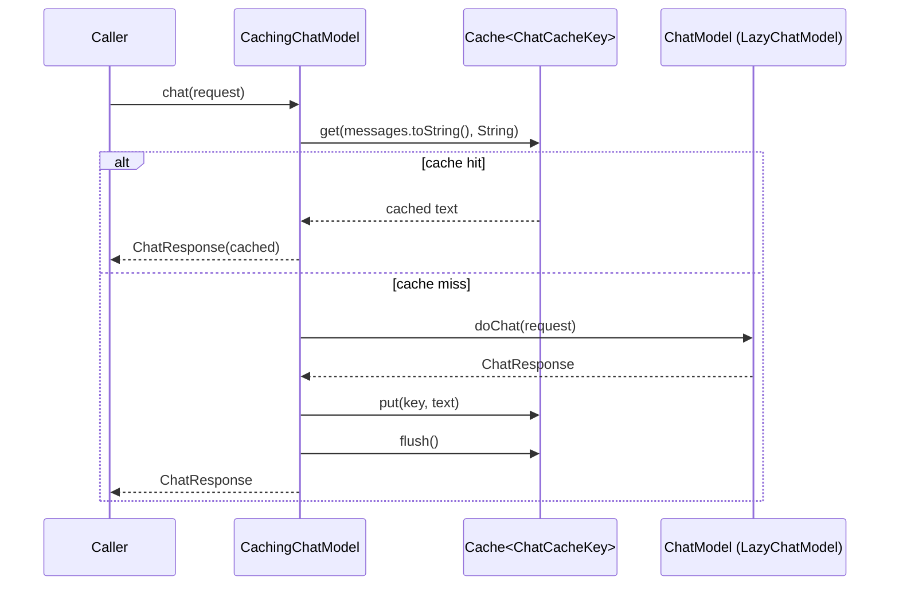

# Cached Chat Requests

There are two ways to cache chat responses, both backed by a `Cache<ChatCacheKey>` obtained
from [CacheManager](cache-hierarchy.md):

1. **`CachingChatModel`** — a decorator wrapping any `ChatModel` that caches transparently,
   including multi-message chats, without changing call sites.
2. **`ChatModelUtils`** — utility methods for explicit single (`cachedRequest`) or n-fold
   (`nCachedRequest`) cached calls against a raw `ChatModel` and a cache.

Both key on the request content and use the same [cache keys](cache-keys.md) and
[cache backends](cache-backends.md).

## CachingChatModel

`CachingChatModel implements ChatModel` wraps a `delegate` `ChatModel` and a
`Cache<ChatCacheKey>`. Because all `ChatModel.chat(...)` overloads funnel through the
single `doChat(ChatRequest)` default method, caching is implemented once at that point:

- **Cache key:** `chatRequest.messages().toString()`. Line endings are normalized by
  [KeyGenerator](configuration.md) when the cache derives its local key.
- **Hit:** returns `ChatResponse.builder().aiMessage(AiMessage.from(cached)).build()`
  without contacting the delegate.
- **Miss:** forwards to `delegate.doChat`, stores `response.aiMessage().text()`, and calls
  `cache.flush()` so the response is persisted immediately (relevant for the file-based
  [LocalCache](cache-backends.md)).
- Non-caching methods (`defaultRequestParameters`, `listeners`, `provider`,
  `supportedCapabilities`) delegate directly to the wrapped model.

Constructor requires non-null `delegate` and `cache`.

## ChatModelUtils

`ChatModelUtils.nCachedRequest(request, llm, cache, numberOfRequests)` sends
`numberOfRequests` independent `llm.chat(request)` calls, caches the resulting `List<String>`
under a composite key, and returns all responses.

- **Cache key:** `numberOfRequests + " results: \n" + request`. The count prefix keeps
  multi-result entries distinct from single-result ones stored by `cachedRequest`.
- **Hit shortcut:** if a cached list has at least `numberOfRequests` entries, no model
  calls are made.
- `cachedRequest(request, llm, cache)` delegates to `nCachedRequest(..., 1)` and returns the
  first element.
- `nCachedRequest` throws `IllegalArgumentException` if `numberOfRequests < 1`.

## Choosing between the two

- Use `CachingChatModel` when you want caching to be invisible to call sites (e.g. a service
  that already holds a `ChatModel`). Multi-message conversations are cached by message
  content.
- Use `ChatModelUtils` when you want explicit control over n-fold sampling against a raw
  model, or when you obtain a cache separately from the model.

## Focused tests

- `CachingChatModelTest` — `cachesStringChat`, `cachesMessageListChat`, `cachesVarargsChat`,
  `cachesRequestChat` (delegate called once per unique input across all overloads), and
  `cachePersistsAcrossReload` (a new `CachingChatModel` over a reloaded `CacheManager`
  serves the cached value with zero delegate calls). Uses a `RecordingChatModel` helper.
- `ChatModelUtilsTest` — `testCachedRequestCaches`, `testNCachedRequest` (3 calls, then
  served from cache), `testCachePersistence` (flush + manager reload, then
  `verifyNoInteractions`), and `testInvalidCount` (throws for 0).

*CachingChatModel intercepts doChat to serve cache hits and write-through misses.*
