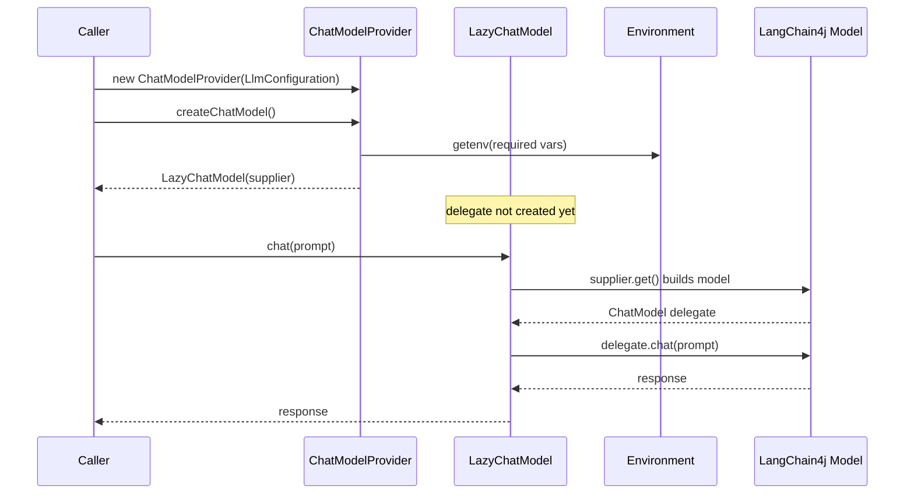

# Chat Models

The chat subsystem turns a framework-neutral configuration into a LangChain4j
`dev.langchain4j.model.chat.ChatModel`. All platform branches return a [LazyChatModel](#lazychatmodel)
so the real model is not constructed until the first `chat(...)` call — credentials and
hosts are only required at that point, not at provider construction time.

The provider also exposes the model configuration as a `ChatCacheParameter` so callers can
obtain a matching cache (see [Cache Keys](cache-keys.md)).

## LlmConfiguration

`edu.kit.kastel.mcse.ardoco.llm.chat.LlmConfiguration` is a record capturing `platform`,
`modelName`, `seed`, and `temperature`. Use `LlmConfiguration.of(platform, modelName)` for
defaults, or the builder to override `seed`/`temperature`.

Invariants:

- Canonical constructor: `platform` and `modelName` must be non-null.
- `Builder.build()` throws `IllegalArgumentException` if `modelName` is null or blank.
- Defaults: `DEFAULT_SEED = 133742243`, `DEFAULT_TEMPERATURE = 0.0`.

These defaults matter for reproducibility and caching: with a fixed seed and temperature,
identical prompts map to the same cache entry (see [Cache Core](cache-core.md)).

## ChatModelPlatform

`edu.kit.kastel.mcse.ardoco.llm.chat.ChatModelPlatform` is an enum with `OPENAI`, `OLLAMA`,
`BLABLADOR`, `DEEPSEEK`, `OPENWEBUI`. `fromString` is case-insensitive and throws
`IllegalArgumentException` for unknown names. The model name is supplied separately via
`LlmConfiguration`, not via the platform.

## ChatModelProvider

`ChatModelProvider(LlmConfiguration)` stores the platform, model name, seed, and
temperature. `createChatModel()` switches on the platform and delegates to private factory
methods that each return a `LazyChatModel`. Credentials and hosts are read through
[Environment](configuration.md).

| Platform | Env vars (required bold) | Notes |
| --- | --- | --- |
| `OPENAI` | **`OPENAI_API_KEY`**, `OPENAI_ORGANIZATION_ID` (optional) | Uses `OpenAiChatModel`; organization id sent only when set. |
| `OLLAMA` | **`OLLAMA_HOST`**, `OLLAMA_USER`+`OLLAMA_PASSWORD` or `OLLAMA_TOKEN` | Basic auth takes precedence over token. With a token it builds an OpenAI-compatible model against the host. 10-minute timeout. |
| `BLABLADOR` | **`BLABLADOR_API_KEY`** | OpenAI-compatible; hardcoded `https://api.helmholtz-blablador.fz-juelich.de/v1`. |
| `DEEPSEEK` | **`DEEPSEEK_API_KEY`** | OpenAI-compatible; hardcoded `https://api.deepseek.com/v1`. |
| `OPENWEBUI` | **`OPENWEBUI_URL`**, **`OPENWEBUI_API_KEY`** | OpenAI-compatible; 10-minute timeout. |

Invariants:

- `createChatModel()` throws `IllegalStateException` when a required env var is missing.
  Missing keys are detected eagerly (before the lazy supplier runs) for OpenAI/Blablador/
  DeepSeek/OpenWebUI; for Ollama the `OLLAMA_HOST` check is eager.
- `cacheParameters()` returns `new ChatCacheParameter(modelName, seed, temperature)` —
  the identity used to obtain a cache from `CacheManager` (see [Cache Hierarchy and Manager](cache-hierarchy.md)).

## LazyChatModel

`LazyChatModel implements ChatModel` wraps a `Supplier<ChatModel>` and creates the delegate
exactly once via thread-safe double-checked locking (a `volatile` field plus a `synchronized`
block). Every public `ChatModel` method delegates to the lazily-resolved delegate.

This is why `ChatModelProvider` can return a model even when credentials are not yet
available: construction is cheap and deferred. The first `chat(...)` call triggers the real
LangChain4j builder, which is where missing credentials or unreachable hosts surface.

## Adding a chat platform

1. Add a constant to `ChatModelPlatform` (it is used by `fromString`, so keep it uppercase).
2. Add a `case` in `ChatModelProvider.createChatModel()` and a private `createXyzChatModel`
   factory that returns a `LazyChatModel` wrapping the LangChain4j builder. Read credentials
   through `Environment.getenv`/`getenvNonNull` (see [Configuration and Environment](configuration.md)).
3. Extend `ChatModelProviderTest.missingCredentialsThrow` or `buildsOpenAiChatModel` to cover
   the new branch; add the env var to `src/test/resources/.env-test` if the branch should
   construct successfully in tests.

## Focused tests

- `ChatModelProviderTest` — `exposesSettings`, `buildsOpenAiModel`, `missingCredentialsThrow`
  (verifies the lazy model is returned and missing-credential branches throw).
- `ChatConfigurationTest` — `LlmConfiguration` defaults/builder validation, `ChatModelPlatform.fromString`,
  and `cacheParameters()` file-identifier format (`gpt-4o_133742243` omits temperature when 0.0).
- `LazyChatModelTest` — `lazyInitialization` (supplier runs once across two calls) and
  `nullSupplier` (constructor null check).

*Chat model construction is deferred until the first chat call via LazyChatModel.*
